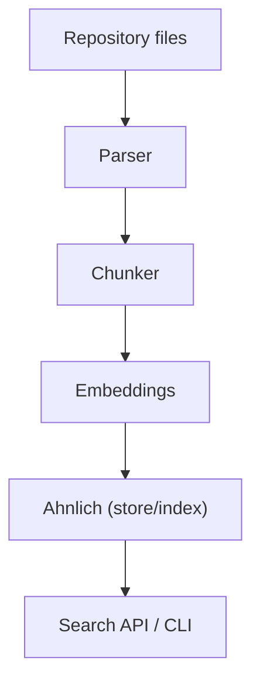

# DevMind

DevMind is a CLI tool for semantic Rust code search and fast codebase discovery.

## Why DevMind

Ever started a new role and spent days grepping around to understand how the code works? Or been asked the same onboarding questions repeatedly by new teammates or interns? DevMind is built to end that friction.

DevMind traverses a Rust repository, extracts meaningful code constructs (functions, types, modules, comments), embeds them into vector space, and stores those embeddings in a lightweight local vector store (Ahnlich). Instead of `grep`-ing for names like “auth”, “jwt” or “token”, ask plain-English questions such as “How is authentication handled?” and get the exact code snippets that answer the question.

## Features

- Fast repository traversal and language-aware chunking.
- Local, lightweight vector store backed by Ahnlich (Docker available).
- CLI-first UX for indexing, querying, and inspecting results.
- Extensible parser and embedding integration.

## Contents

- **Entry point:** [src/main.rs](src/main.rs)
- **Configuration:** [dev_mind.example.toml](dev_mind.example.toml)
- **CLI:** [src/cli/mod.rs](src/cli/mod.rs)
- **Parser / chunker:** [src/parser/mod.rs](src/parser/mod.rs) and [src/parser/chunk.rs](src/parser/chunk.rs)
- **Embeddings & storage:** [src/embeddings/mod.rs](src/embeddings/mod.rs) and [src/embeddings/ahnlich.rs](src/embeddings/ahnlich.rs)
- **Search primitives:** [src/search/mod.rs](src/search/mod.rs)
- **Utilities:** [src/utils/mod.rs](src/utils/mod.rs)

Architecture (high level)



## Getting started

Prerequisites

- Rust stable toolchain
- A running Ahnlich instance (local Docker or remote)
- Optional local Ahnlich setup: `ahnlich-docker-compose.yml`

Build

```bash
git clone <repo-url>
cd dev_mind
cargo build --release
```

Config

```bash
cp dev_mind.example.toml dev_mind.toml
# edit dev_mind.toml: set `ahnlich_addr`, `store`, and `ignore` globs
```

Quick run

```bash
# show CLI help
./target/release/dev_mind --help

# or with cargo
cargo run --release -- --help
```

## Usage examples

Use the commands in the order below.

```bash
# initialize the local Ahnlich store for this project
./target/release/dev_mind init

# index the repository from the current working directory (default path is the current folder)
./target/release/dev_mind index --path src/

# ask a semantic question against the indexed codebase
./target/release/dev_mind ask --query "how is file traversal handled" --n 5
```

### Command descriptions

- `init`
  - Creates the local Ahnlich store for this project.
  - Run this once before indexing so the vector database is prepared.

- `index`
  - Walks the codebase, parses Rust files, and pushes embeddings to Ahnlich.
  - `--path` resolves to an absolute path; if omitted it defaults to the directory where the CLI was run.

- `ask`
  - Queries the indexed repository in plain English.
  - `--query` is the natural-language search question.
  - `--n` sets the number of nearest results to return.

## Typical workflow

1. Configure `dev_mind.toml` with your `ahnlich_addr` and `store`.
2. Run `init` to create the local Ahnlich store.
3. Run `index --path src/` from your repository root.
4. Run `ask --query "how is file traversal handled"` to inspect results.

## Developer notes

- Parser: [src/parser](src/parser/mod.rs) handles traversing and chunk boundaries.
- Embeddings: [src/embeddings/ahnlich.rs](src/embeddings/ahnlich.rs) contains client glue using `ahnlich_client_rs`.
- Config loader: [src/config.rs](src/config.rs).

## Contributing

Contributions welcome. For substantive changes, open an issue first to discuss design. Keep the code formatted with `cargo fmt` and lint with `cargo clippy`.

## Testing & CI

Run unit tests with `cargo test`. Suggested CI steps:

```bash
cargo fmt -- --check
cargo clippy -- -D warnings
cargo test --all
```

<!-- ## Roadmap

- Add end-to-end integration tests against a local Ahnlich instance.
- Improve chunking heuristics for macro-heavy and generated code. -->

See `ahnlich_client_rs` and `ahnlich_types` in `Cargo.toml` for the embedding/store integration.

---
