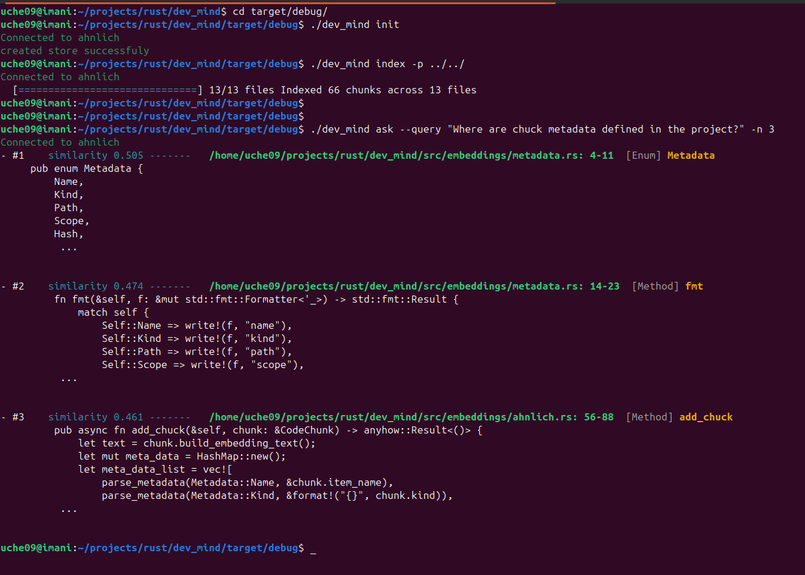
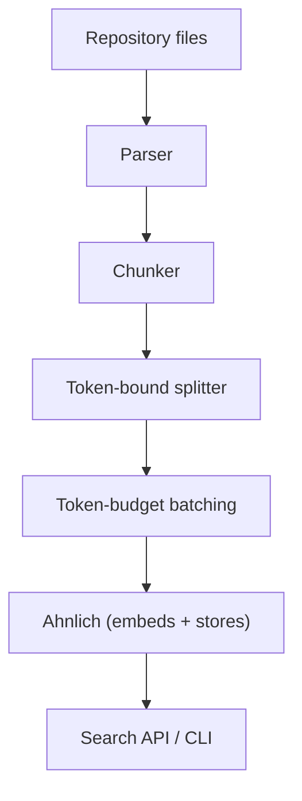

# DevMind



DevMind is a CLI tool for semantic Rust code search and fast codebase discovery.

## Why DevMind

Ever started a new role and spent days grepping around to understand how the code works? Or been asked the same onboarding questions repeatedly by new teammates or interns? DevMind is built to end that friction.

DevMind traverses a Rust repository, extracts meaningful code constructs (functions, types, modules, comments), embeds them into vector space, and stores those embeddings in a lightweight local vector store (Ahnlich). Instead of `grep`-ing for names like "auth", "jwt" or "token", ask plain-English questions such as "How is authentication handled?" and get the exact code snippets that answer the question.

## Features

- Fast repository traversal and language-aware chunking.
- Token-aware chunk splitting: oversized functions, structs, and impls are automatically bounded to fit the embedding model's context window, so large or generated files don't crash indexing.
- Local, lightweight vector store backed by Ahnlich (Docker available).
- Layered configuration: one global default plus per-project overrides, so you set your Ahnlich address once and reuse it across every repo.
- CLI-first UX for indexing, querying, and inspecting results.
- Extensible parser and embedding integration.

## Contents

- **Entry point:** [src/main.rs](src/main.rs)
- **Configuration:** [devmind.example.toml](devmind.example.toml), [src/config.rs](src/config.rs)
- **CLI:** [src/cli/mod.rs](src/cli/mod.rs)
- **Parser / chunker:** [src/parser/mod.rs](src/parser/mod.rs) and [src/parser/chunk.rs](src/parser/chunk.rs)
- **Token-bound splitting:** [src/parser/tokenizer.rs](src/parser/tokenizer.rs)
- **Embeddings & storage:** [src/embeddings/mod.rs](src/embeddings/mod.rs) and [src/embeddings/ahnlich.rs](src/embeddings/ahnlich.rs)
- **Indexing & batching:** [src/indexer.rs](src/indexer.rs)
- **Search primitives:** [src/search/mod.rs](src/search/mod.rs)
- **Utilities:** [src/utils/mod.rs](src/utils/mod.rs)

Architecture (high level)



## Prerequisites

- Rust stable toolchain
- Docker and Docker Compose, to run Ahnlich locally
- ~1GB free disk space and a decent internet connection for the first Ahnlich AI startup (see [Setting up Ahnlich](#setting-up-ahnlich) below)

## First-time setup

Follow these steps in order. Skipping ahead, especially step 2, is the most common source of confusing errors on a first run.

### 1. Build DevMind

```bash
git clone https://github.com/uche09/dev_mind.git
cd dev_mind
cargo build --release
```

This produces the binary at `target/release/devmind`. The rest of this README assumes it's on your `PATH`; either add `target/release` to your `PATH`, or install it properly:

```bash
cargo install --path .
```

### 2. Setting up Ahnlich

DevMind depends on a running Ahnlich instance (`ahnlich-db` + `ahnlich-ai`) for storing and searching embeddings. A ready-made Compose file is included:

```bash
docker compose -f ahnlich-docker-compose.yml up
```

> **⏳ First run downloads an embedding model, this can take a while.**
> The `ahnlich_ai` service pulls the `jina-embeddings-v2-base-code` model on its first boot. Depending on your connection speed, this download can take anywhere from a couple of minutes to well over ten. The container will look like it's hanging with no output, it isn't, just let it finish. Subsequent starts are fast since the model is cached in the container layer. If you're on a slow or metered connection, kick this off first and go do something else while it downloads, before touching any `devmind` command.

Leave this running in its own terminal (or add `-d` to run it detached), then continue in a second terminal.

### 3. Generate your config files

```bash
devmind config init
```

This creates two files:

- **Global config**, at `~/.config/devmind/config.toml` (Linux, via the XDG Base Directory convention), holding your `ahnlich_addr`. This is your machine-wide default, set once, used by every project.
- **Project config**, `devmind.toml` in your current directory, holding `store` and `ignore` glob patterns for this specific repository.

If you only want one of the two, scope it explicitly:

```bash
devmind config init --scope global
devmind config init --scope project
```

Override any default at creation time instead of editing the file afterward:

```bash
devmind config init --ahnlich-addr localhost:1370 --store my_project_code --ignore "**/target" --ignore "tests/**"
```

Already have a config file and want to regenerate it with new values? Pass `--force` to overwrite:

```bash
devmind config init --force
```

Running `devmind config init` again for a *new* project only needs `--scope project`, your global Ahnlich address is already set and will be inherited automatically. A project's `devmind.toml` only needs to declare what's different for that repo, typically just `store` and `ignore`.

Check what DevMind currently resolves for any setting at any time:

```bash
devmind config get ahnlich-addr
devmind config get store
devmind config get ignore
```

### 4. Initialize the store

With Ahnlich running (step 2) and config in place (step 3):

```bash
devmind init
```

This creates the Ahnlich store named in your `devmind.toml`. Run this once per project, before indexing.

### 5. Index your codebase

```bash
devmind index --path src/
```

Walks the given path (defaults to the current directory if `--path` is omitted), parses Rust files, and pushes their embeddings to Ahnlich. Re-run this whenever the codebase changes meaningfully enough that you want search results to reflect it.

### 6. Ask questions

```bash
devmind ask --query "how is file traversal handled" --n 5
```

`--query` is your natural-language question, `--n` controls how many results come back (default 5).

## Configuration reference

DevMind resolves configuration in layers, each one overriding only the fields it explicitly sets:

| Order (low → high precedence) | Source | Scope |
|---|---|---|
| 1 | Built-in defaults | — |
| 2 | `~/.config/devmind/config.toml` | Global, all projects |
| 3 | Nearest `devmind.toml`, found by walking up from your current directory | Per-project |
| 4 | `DEVMIND_CONFIG` env var | One-off override |
| 5 | `--config <path>` flag | One-off override |

Settings:

| Key | Typical layer | Meaning |
|---|---|---|
| `ahnlich_addr` | Global | Address of your Ahnlich AI proxy, e.g. `localhost:1370` |
| `store` | Project | Name of the Ahnlich store for this repository |
| `ignore` | Project | Glob patterns excluded from indexing, e.g. `**/target`, `**/*.lock` |

You rarely need to hand-edit either file, `devmind config init` and its flags cover the common cases, and `devmind config get <key>` lets you confirm what's actually in effect without opening any file.

## Command reference

- **`config init`**
  Generates global and/or project config files with defaults, or with values you supply. See [step 3](#3-generate-your-config-files) above for flags.

- **`config get <key>`**
  Prints the currently resolved value for `ahnlich-addr`, `store`, or `ignore`.

- **`init`**
  Creates the local Ahnlich store for this project. Run once before indexing.

- **`index`**
  Walks the codebase, parses Rust files, and pushes embeddings to Ahnlich.
  `--path` resolves to an absolute path; defaults to the current directory if omitted.

- **`ask`**
  Queries the indexed repository in plain English.
  `--query` is the natural-language search question.
  `--n` sets the number of nearest results to return.

## Developer notes

- Parser: [src/parser](src/parser/mod.rs) handles traversing and chunk boundaries.
- Token-bound splitting: [src/parser/tokenizer.rs](src/parser/tokenizer.rs) caps each chunk to the embedding model's max input size, splitting oversized constructs along statement boundaries first, then falling back to line windows splitting for anything still too dense.
- Embeddings: [src/embeddings/ahnlich.rs](src/embeddings/ahnlich.rs) contains client glue using `ahnlich_client_rs`.
- Indexing & batching: [src/indexer.rs](src/indexer.rs) groups bounded chunks into token-budgeted batches and dispatches them to Ahnlich.
- Config loader and layered merge logic: [src/config.rs](src/config.rs).

## Contributing

Contributions welcome. For substantive changes, open an issue first to discuss design. Keep the code formatted with `cargo fmt` and lint with `cargo clippy`.

## Testing & CI

Run unit tests with `cargo test`. Suggested CI steps:

```bash
cargo fmt -- --check
cargo clippy -- -D warnings
cargo test --all
```

Three benchmark suites live under `benches/`. `parsing_bench` is pure CPU-bound parsing and runs anywhere. `ahnlich_bench` and `padding_bench` are integration benchmarks, they need a running Ahnlich instance and make real embedding calls, so they're slower and not meant for every CI run:

```bash
cargo bench --bench parsing_bench   # no Ahnlich required
cargo bench --bench ahnlich_bench   # requires `docker compose -f ahnlich-docker-compose.yml up`
cargo bench --bench padding_bench   # requires `docker compose -f ahnlich-docker-compose.yml up`
```

<!-- ## Roadmap

- Make token-bound splitting and batching settings (max tokens per chunk, batch size, concurrency) configurable via devmind.toml instead of hardcoded constants.
- Convert ahnlich_bench / padding_bench into proper end-to-end integration tests, not just benchmarks, so regressions fail CI instead of only showing up in manual runs. -->

See `ahnlich_client_rs` and `ahnlich_types` in `Cargo.toml` for the embedding/store integration.

---
